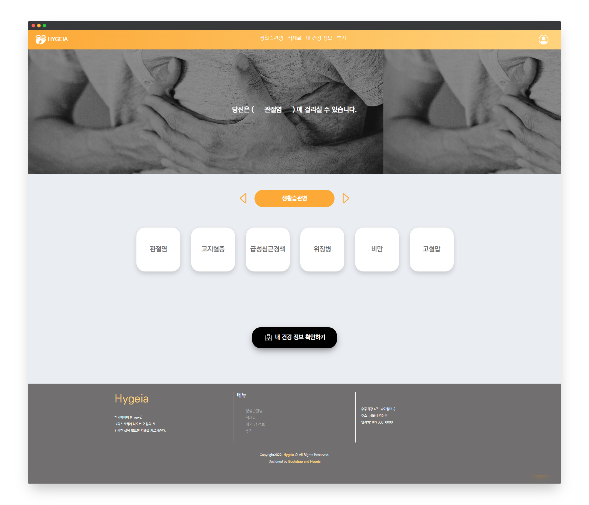
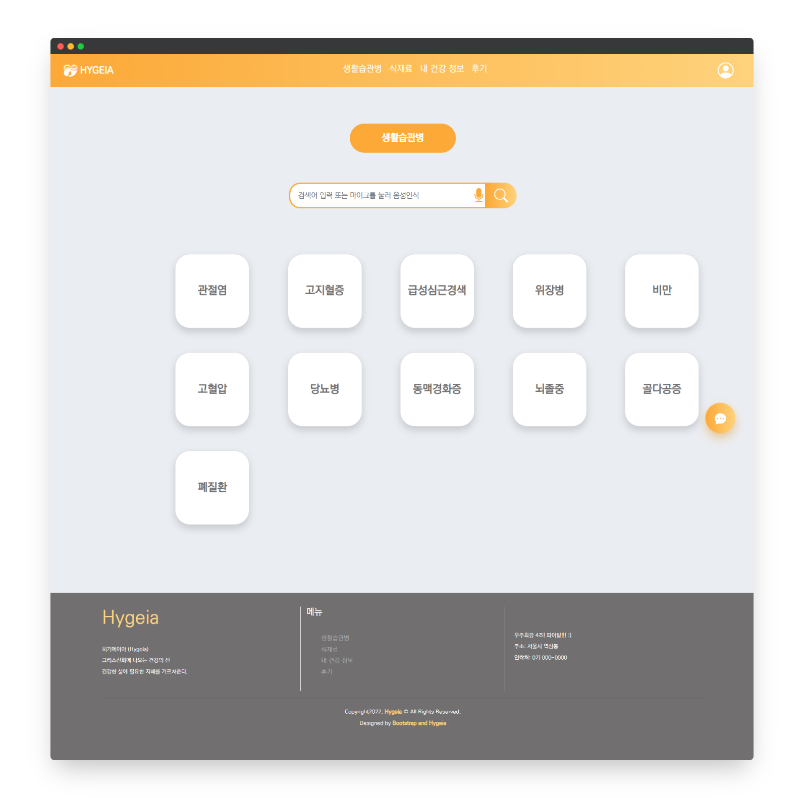
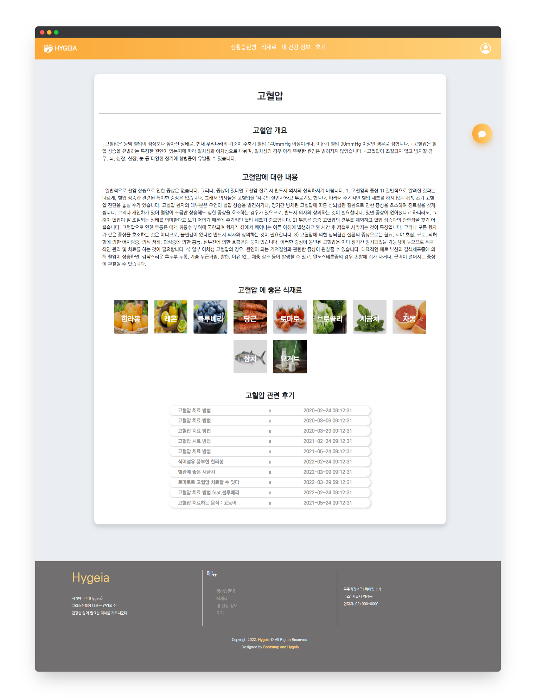

# 생활습관병(성인병) 예방 및 증상 완화를 위한  식재료 정보 제공 서비스

> <b>Hygeia</b>(히기에이아)란 그리스 로마 신화에 등장하는 의술의 신 아스클레피오스의 딸로 건강과 위생을 주관하는 신을 의미합니다.  

 

### 프로젝트 개발 기간

`2022.04.01.` - `2022.04.29.` (4주)

### 팀 활동

 

   

 

# 📌 기술 스택

### Back-End

  
  
  

### Front-End

   
   
  
  
   

### VCS

  
  
  

### DevTool

  
  
  

### Project Management Tool

  
  
  

 

# 📌 프로젝트 배경

- 생활습관병 증상을 개선하기 위해 파편화된 식재료 정보를 수집할 때 어려움이 있다.
- 식습관 개선을 통해 생활습관병을 완화 및 예방하려고 하는 사람들에게 정보와 부가적인 기능을 제공한다.

 

# 📌 프로젝트 개요

### 정보 제공

- [질병관리청 국가건강정보포털](https://health.kdca.go.kr/)에서 제공하는 생활습관병 데이터를 이용하여 정보 제공
- 농림축산식품 공공데이터 포털에서 제공하는 [제철 농산물 상세정보](https://data.mafra.go.kr/opendata/data/indexOpenDataDetail.do?data_id=20171128000000000925) OpenAPI를 이용하여 식재료 정보를 제공
- 증상 완화에 효과가 있는 식재료를 매칭

### 설문 형식의 맞춤 정보 제공

- 간단한 질문을 통해 발생 가능성이 있는 생활습관병 예측
- 질문마다 생활습관병에 대해 가중치를 부여하여 판단
- 해당 생활습관병을 예방에 효과가 있는 식재료 매칭

### 챗봇

- 네이버 클라우드 플랫폼 CLOVA chatbot custom API를 이용
- 생활습관병의 종류와 세부적인 정보 제공
- 챗봇을 통한 서비스 이용 가능

### 식재료 검색

- 키워드 입력시 자동완성
- 네이버 CLOVA Speech Recognition을 이용한 STT 기능

 

# 📌 서비스 화면

### 메인

### 로그인

### 회원가입

### 생활습관병

리스트

상세보기

### 식재료

리스트

상세보기

검색

### 내 건강 정보

문항

결과

### 마이페이지

### 후기

리스트

상세보기

### 챗봇

# 📌 프로젝트 산출물

### ERD

### 화면 흐름도

### 기능

### 챗봇 시나리오

 

# 📌 기대효과

- 생활습관병과 식재료와 관련된 정보를 찾는 시간 절약
- 정보를 쉽고 편리하게 조회
- 생활습관병 관련 커뮤니티 형성

 

# 📌 팀원 소개

| 이새하                                                              | 김정규                                                          | 연주원                                                            | 이종무                                                            | 이훈학                                                            |
| ------------------------------------------------------------------- | --------------------------------------------------------------- | ----------------------------------------------------------------- | ----------------------------------------------------------------- | ----------------------------------------------------------------- |
|                              |                              |                            |                              |                              |
| 팀장  PM  챗봇 기능  DB 모델링  마이 페이지  UI 설계 |  생활습관병 정보 제공 기능  후기 기능                     |  회원 관리  메인 페이지  식재료 검색 기능                |  증상 테스트 기능  문서화  최종 발표                     |  식재료 정보 제공 기능                                      |

 
